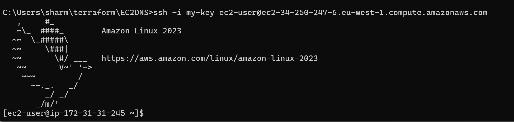
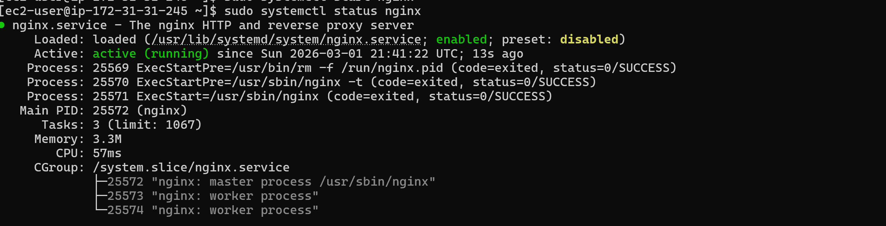
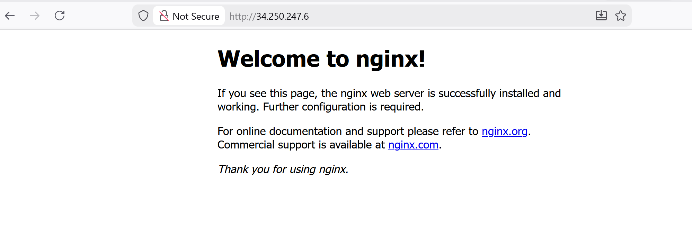
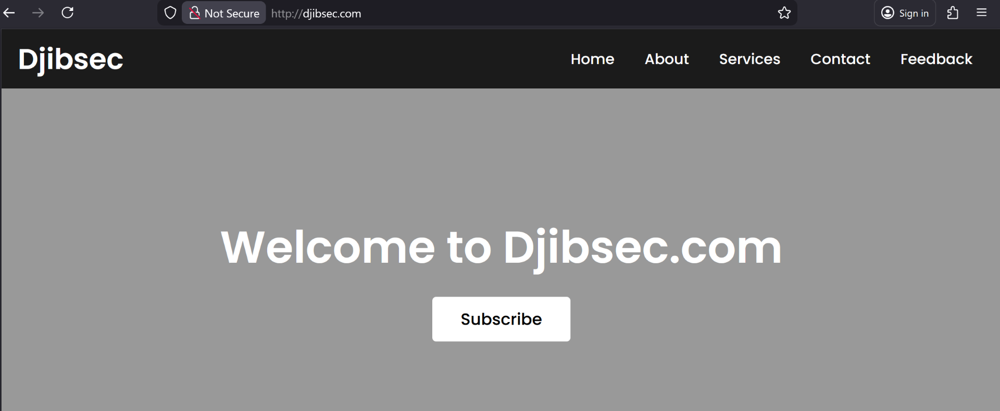
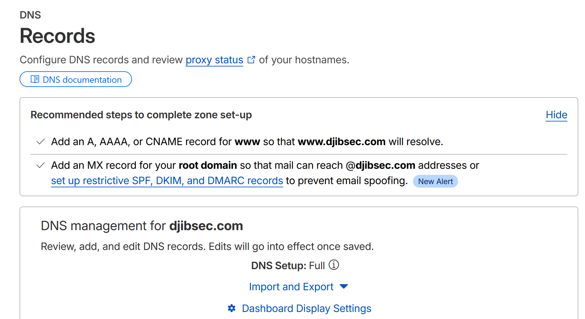
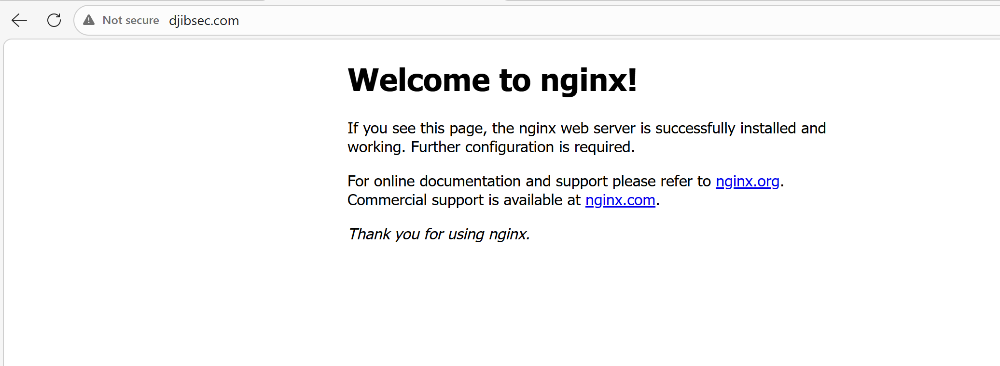

# Lab: Nginx Web Server on EC2 with Cloudflare DNS

**Lab Objective:** Deploy a publicly accessible Nginx web server on AWS EC2 and point a custom domain to it via Cloudflare DNS.

**Requirements:** AWS account, Cloudflare account, SSH key pair

---

## Contents

- [Step 1. Buy a Domain (Cloudflare)](#step-1-buy-a-domain-cloudflare)
- [Step 2. Launch EC2 Instance](#step-2-launch-ec2-instance)
- [Step 3. Install & Start Nginx](#step-3-install--start-nginx)
- [Step 4. Configure DNS in Cloudflare](#step-4-configure-dns-in-cloudflare)
- [Step 5. Recommendation of Best Practice](#step-4-Recommendation-of-best-practice)
  
---

## Step 1. Buy a Domain (Cloudflare)

1. Cloudflare dashboard → **Domains** → **Buy a domain**
2. Search and purchase your domain

> My domain: `Djibsec.com`

---

## Step 2. Launch EC2 Instance

**Launch settings:**

| Setting | Value |
|---|---|
| AMI | linux |
| Instance type | t3.micro |
| Storage | 8 GB (default) |

**Security group — inbound rules:**

| Port | Protocol | Source | Purpose |
|---|---|---|---|
| 22 | SSH | Your IP | Remote access |
| 80 | HTTP | 0.0.0.0/0 | Web traffic |
| 443 | HTTPS | 0.0.0.0/0 | Secure web traffic |

Limit port 22 access to your specific IP in a live environment. 

If you are applying this outside the instance configuration menu: **Actions → Security → Change security groups**

**Note your public IP** (Networking tab) — needed for DNS config.

> Instance IP: `34.250.247.6`

---

## Step 3. Install & Start Nginx

SSH into the instance:

```bash
ssh -i your-key.pem ubuntu@34.250.247.6
```

Install and start Nginx:

```bash
sudo apt update -y && sudo apt install -y nginx
sudo systemctl start nginx && sudo systemctl enable nginx
```

**Verify:Nginx service is running**

```bash
sudo systemctl status nginx
```

This should show the service is active (running) as shown in green highligthed.




When visit `http://34.250.247.6` in a browser. You should see the Nginx welcome page.



---

## Step 4. Configure DNS in Cloudflare

Dashboard → **DNS** → **Records** → **Add record**

| Field | Value |
|---|---|
| Type | A |
| Name | @ (root domain) |
| IPv4 address | 34.250.247.6` |
| TTL | Auto |
| Proxy status | DNS only (grey cloud) |

Mapping the EC2 instance IP address 34.250.247.6 to  Djibsec.com  domain 


Registering Djibsec.com domain




A-record for Djibsec.com



You should now be able to access `djibsec.com`



## Difficulties encounters during the repro of this lab:

HTTPS/http Not Working with Cloudflare and EC2 (No SSL Certificate)

Root Cause:

By default Cloudflare use SSL certificate

Fix:

Navigate to Go to **SSL/TLS → Overview**
- Click **Custom** to override the automatic setting
- Change the encryption mode from **Full** to **Flexible**
- Click  Save button

## EC2 Public IP Changes on Stop/Start

Whenever an EC2 instance is halted and restarted, AWS assigns a different public IP address to it
 
#Root Cause:

 Fix:
 
- You point out the new IP address  of EC2 instance in Cloudfare
-Or use statis IP address known as Elastic IP ( https://docs.aws.amazon.com/AWSEC2/latest/UserGuide/elastic-ip-addresses-eip.html)


## Recommendation of Best practice:

Restrict access to port 22 to your designated IP address in a production setting.

Consider using SSL certificate in Cloudflare for environment project  and select the full mode option.


