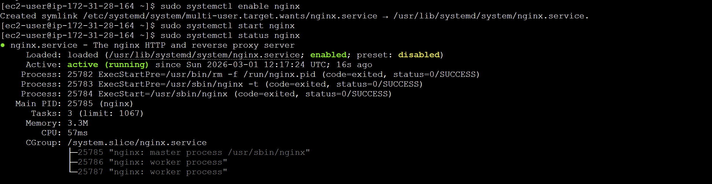
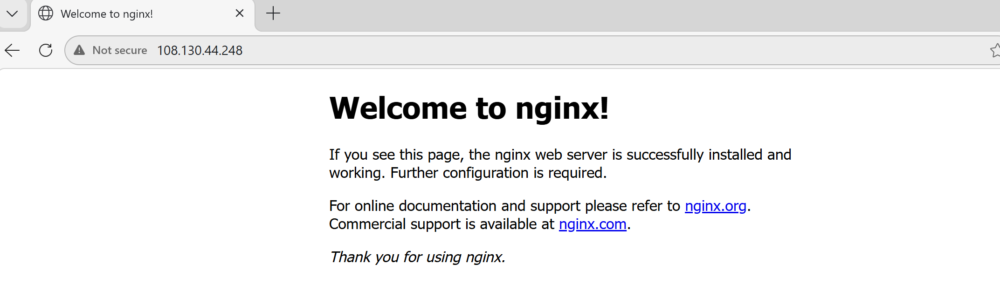
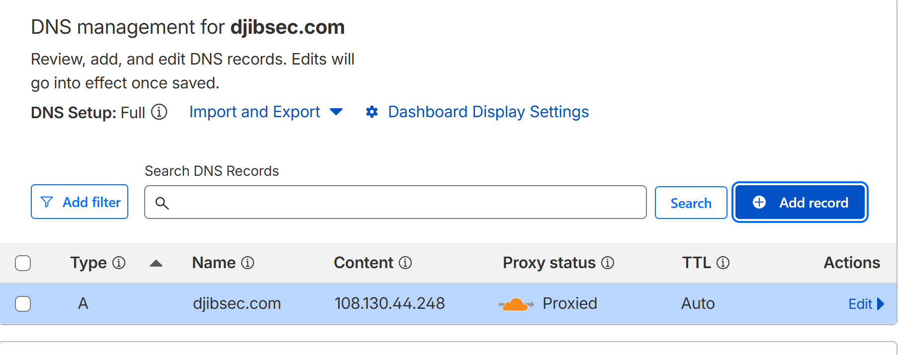

# Lab: Nginx Web Server on EC2 with Cloudflare DNS

**Objective:** Deploy a publicly accessible Nginx web server on AWS EC2 and point a custom domain to it via Cloudflare DNS.

**Requirements:** AWS account, Cloudflare account, SSH key pair

---

## Contents

- [Step 1. Buy a Domain (Cloudflare)](#step-1-buy-a-domain-cloudflare)
- [Step 2. Launch EC2 Instance](#step-2-launch-ec2-instance)
- [Step 3. Install & Start Nginx](#step-3-install--start-nginx)
- [Step 4. Configure DNS in Cloudflare](#step-4-configure-dns-in-cloudflare)
- [Troubleshooting](#troubleshooting)
  - [HTTPS Not Working with Cloudflare and EC2](#https-not-working-with-cloudflare-and-ec2-no-ssl-certificate)
  - [EC2 Public IP Changes on Stop/Start](#ec2-public-ip-changes-on-stopstart)

---

## Step 1. Buy a Domain (Cloudflare)

1. Cloudflare dashboard → **Domains** → **Buy a domain**
2. Search and purchase your domain

> My domain: `Djibsec.com`

---

## Step 2. Launch EC2 Instance

**Launch settings:**

| Setting | Value |
|---|---|
| AMI | linux |
| Instance type | t3.micro |
| Storage | 8 GB (default) |

**Security group — inbound rules:**

| Port | Protocol | Source | Purpose |
|---|---|---|---|
| 22 | SSH | Your IP | Remote access |
| 80 | HTTP | 0.0.0.0/0 | Web traffic |
| 443 | HTTPS | 0.0.0.0/0 | Secure web traffic |

Limit port 22 access to your specific IP in a live environment. 

If you are applying this outside the instance configuration menu: **Actions → Security → Change security groups**

**Note your public IP** (Networking tab) — needed for DNS config.

> Instance IP: `108.130.44.248`

---

## Step 3. Install & Start Nginx

SSH into the instance:

```bash
ssh -i your-key.pem ubuntu@44.204.45.98
```

Install and start Nginx:

```bash
sudo apt update -y && sudo apt install -y nginx
sudo systemctl start nginx && sudo systemctl enable nginx
```

**Verify:Nginx service is running**

```bash
sudo systemctl status nginx
```

This should show the service is active (running) as shown in green highligthed.




When visit `http://108.130.44.248` in a browser. You should see the Nginx welcome page.



---

## Step 4. Configure DNS in Cloudflare

Dashboard → **DNS** → **Records** → **Add record**

| Field | Value |
|---|---|
| Type | A |
| Name | @ (root domain) |
| IPv4 address | 108.130.44.248` |
| TTL | Auto |
| Proxy status | DNS only (grey cloud) |




You should now be able to access `djibsec.com`


